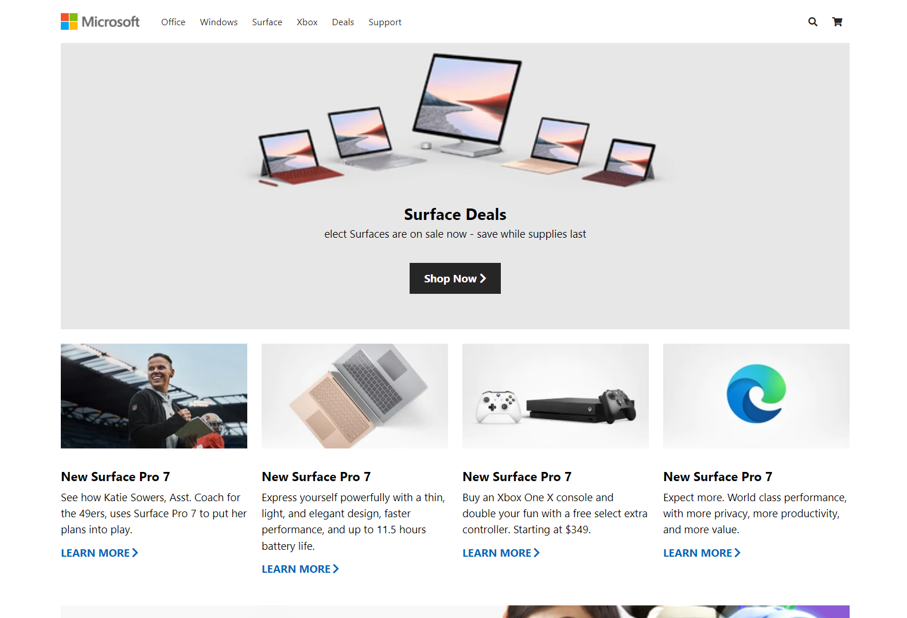

<h1 style='font-size: 40px' align="center">Microsoft Home Page Clone </h1>




<h1 align="center">Full-Responcive</h1>

\
## [Live Damo](https://coder-rakibul.github.io/Microsoft-Home-Page-Clone/): 

## Using By: 
    html
    css [grid, flax]
    javascript  [DOM]
### Clone By 
``` https
    https://github.com/coder-rakibul/Microsoft-Home-Page-Clone.git
```